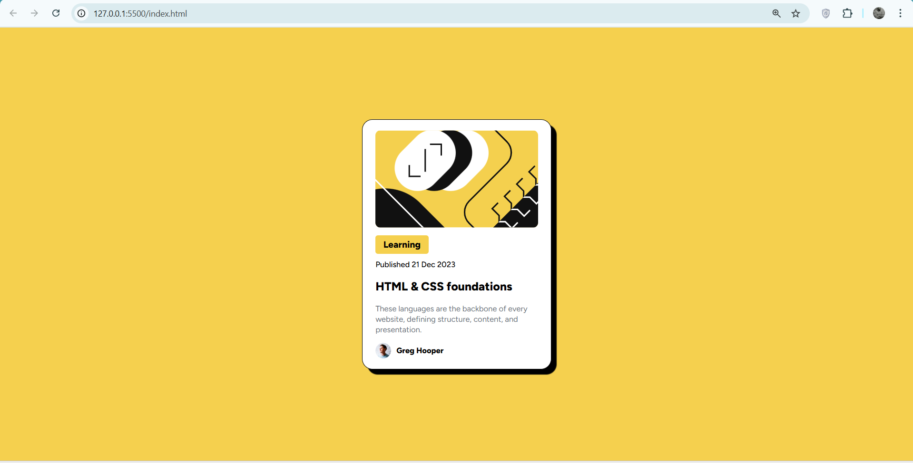
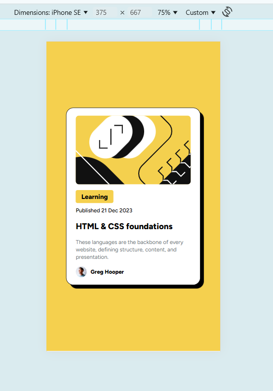

# Blog Preview Card

---

## Overview

This is my solution to the [Frontend Mentor Blog Card Preview challenge](https://www.frontendmentor.io/challenges/blog-preview-card-ckPaj01IcS).  
The goal was to build a visually accurate and responsive QR code component using HTML and Tailwind CSS.

## The Challenge

- Replicate the given Card design as closely as possible.
- Ensure the layout is responsive for both mobile and desktop devices.
- Use semantic HTML and maintain clean, readable code.

## Screenshot

## Built With

- HTML5 – for structure
- Tailwind CSS – for styling
- Google Fonts (FigTree) – for typography
- Flexbox – for centering and layout

## Live Demo

- Live Site: [Netlify Site](https://app.netlify.com/projects/blogcardpreview506/overview)
- Frontend Mentor Solution Page: [Add Link Here](#)

## What I Learned

- How to center content vertically and horizontally using Tailwind's `flex`, `justify-center`, and `items-center`.
- Applying custom background colors using Tailwind’s hex color classes (`bg-[#d5e1ef]`).
- Creating a card-like component with rounded corners, padding, and shadows.
- Using Google Fonts with basic CSS.
- Learned to add box Shadow
  - `shadow-[x_axis_pxiels,y-axis_pixels,shadow_blur_pixels,#color_of_Shadow]`
  - we use negative axis to change the sides on which shadow appears
  - shadows inherit the border radius of the parent
- `w-fit` is used when widht is to be kept around the children and not more.
